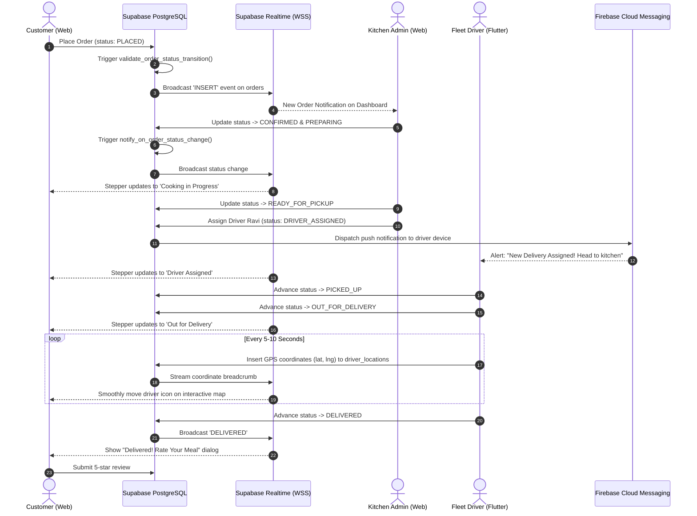

# HomeVibes — End-to-End Sequence Diagrams

This document illustrates the message passing and asynchronous cloud events across all actors and subsystems.

---

## 1. Complete Order to Delivery Lifecycle

