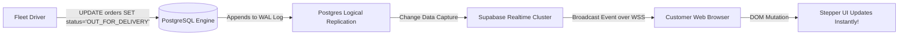

# HomeVibes — Realtime Engine & Change Data Capture (CDC) Architecture

**Communication Protocol:** WebSockets (WSS)  
**Underlying Engine:** Supabase Realtime (Elixir Phoenix Channels)  
**Database Mechanism:** PostgreSQL Write-Ahead Log (WAL) Logical Replication

---

## 1. Why Polling is Prohibited in Production Cloud Apps

Traditional applications frequently use HTTP polling:
```text
Client -> GET /order/status every 2 seconds -> Server (Generates 1800 database queries/hour per active user!)
```
This approach suffers from:
1. **Excessive Resource Waste:** 95%+ of polling requests return identical data, saturating connection pools and driving up compute costs.
2. **High Latency:** Status changes are only observed at the next poll tick (up to 2-3 seconds delay).
3. **Mobile Battery Drain:** Continuous HTTP handshake cycles prevent mobile radios from entering low-power sleep states.

---

## 2. HomeVibes Event-Driven Realtime Pipeline



### Technical Workflow:
1. When an order status is updated in `public.orders` (or a GPS coordinate is inserted into `public.driver_locations`), PostgreSQL commits the transaction to its Write-Ahead Log (WAL).
2. The Supabase Realtime daemon (running Phoenix / Erlang BEAM) tails the logical replication slot.
3. The event payload is matched against client channel filters (e.g. `orders.id=eq.${orderId}`).
4. The event is pushed immediately down the active WebSocket connection to the customer's browser.
5. Latency is measured in **milliseconds (< 120ms)** with **zero polling overhead**.
