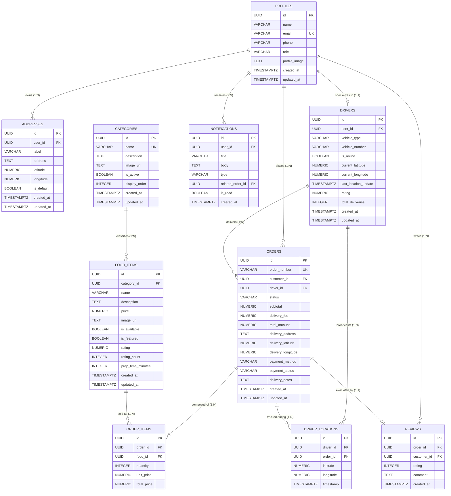

# HomeVibes — Entity-Relationship (ER) Diagram

**Database Engine:** PostgreSQL 15 (Supabase Cloud)  
**Relational Normalization:** 3NF (Third Normal Form)

---

## 1. Complete Entity-Relationship Model

