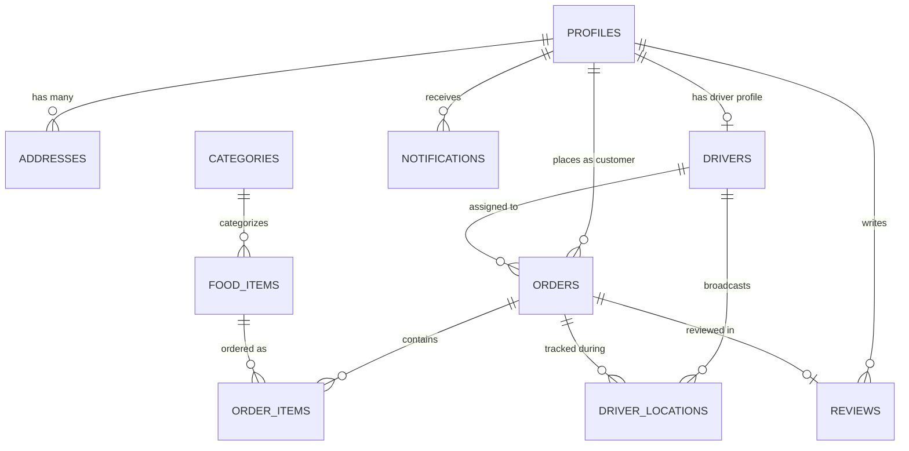

# HomeVibes — Database Data Dictionary & Schema Specification

**Target Engine:** PostgreSQL 15+ (Hosted on Supabase Cloud)  
**Schema:** `public`  
**Security:** Full Row Level Security (RLS) & Multi-Role RBAC

---

## 1. Tables & Relationships

---

## 2. Table Specifications

### 2.1 `profiles`
Represents user profiles synchronized with Supabase's built-in `auth.users` via database trigger.

| Column | Type | Constraints | Description |
| :--- | :--- | :--- | :--- |
| `id` | UUID | PK, FK -> `auth.users(id)` ON DELETE CASCADE | Matches auth user ID |
| `name` | VARCHAR(255) | NOT NULL | User's full name |
| `email` | VARCHAR(255) | NOT NULL, UNIQUE | User email address |
| `phone` | VARCHAR(30) | NULLABLE | Contact telephone |
| `role` | VARCHAR(20) | NOT NULL, DEFAULT 'CUSTOMER' | Enum: `CUSTOMER`, `DRIVER`, `ADMIN` |
| `profile_image`| TEXT | NULLABLE | Supabase Storage URL |
| `created_at` | TIMESTAMPTZ | NOT NULL, DEFAULT now() | Creation timestamp |
| `updated_at` | TIMESTAMPTZ | NOT NULL, DEFAULT now() | Last update timestamp |

### 2.2 `categories`
Food groupings for the central kitchen menu.

| Column | Type | Constraints | Description |
| :--- | :--- | :--- | :--- |
| `id` | UUID | PK, DEFAULT gen_random_uuid() | Category unique identifier |
| `name` | VARCHAR(100) | NOT NULL, UNIQUE | Category title |
| `description` | TEXT | NULLABLE | Descriptive summary |
| `image_url` | TEXT | NULLABLE | Banner or thumbnail image |
| `is_active` | BOOLEAN | NOT NULL, DEFAULT true | Visible on customer menu |
| `display_order`| INTEGER | NOT NULL, DEFAULT 0 | Sorting priority index |
| `created_at` | TIMESTAMPTZ | NOT NULL, DEFAULT now() | Timestamp |
| `updated_at` | TIMESTAMPTZ | NOT NULL, DEFAULT now() | Timestamp |

### 2.3 `food_items`
Dishes and menu items offered by the HomeVibes central kitchen.

| Column | Type | Constraints | Description |
| :--- | :--- | :--- | :--- |
| `id` | UUID | PK, DEFAULT gen_random_uuid() | Item identifier |
| `category_id` | UUID | FK -> `categories(id)` ON DELETE SET NULL | Associated category |
| `name` | VARCHAR(200) | NOT NULL | Dish name |
| `description` | TEXT | NULLABLE | Ingredients and details |
| `price` | NUMERIC(10, 2)| NOT NULL, CHECK (price >= 0) | Current menu price |
| `image_url` | TEXT | NULLABLE | High-res item photograph |
| `is_available`| BOOLEAN | NOT NULL, DEFAULT true | In-stock toggle |
| `is_featured` | BOOLEAN | NOT NULL, DEFAULT false | Displayed in hero showcase |
| `rating` | NUMERIC(3, 2)| DEFAULT 5.00 | Aggregate rating (1.00 - 5.00) |
| `rating_count` | INTEGER | NOT NULL, DEFAULT 0 | Number of ratings |
| `prep_time_minutes`| INTEGER | DEFAULT 20 | Estimated kitchen prep time |
| `created_at` | TIMESTAMPTZ | NOT NULL, DEFAULT now() | Timestamp |
| `updated_at` | TIMESTAMPTZ | NOT NULL, DEFAULT now() | Timestamp |

### 2.4 `addresses`
Saved delivery locations for customers.

| Column | Type | Constraints | Description |
| :--- | :--- | :--- | :--- |
| `id` | UUID | PK, DEFAULT gen_random_uuid() | Address identifier |
| `user_id` | UUID | FK -> `profiles(id)` ON DELETE CASCADE | Profile owner |
| `label` | VARCHAR(50) | NOT NULL, DEFAULT 'Home' | 'Home', 'Work', etc. |
| `address` | TEXT | NOT NULL | Complete formatted address |
| `latitude` | NUMERIC(10, 7)| NOT NULL | GPS latitude |
| `longitude` | NUMERIC(10, 7)| NOT NULL | GPS longitude |
| `is_default` | BOOLEAN | NOT NULL, DEFAULT false | Preferred address flag |

### 2.5 `drivers`
Delivery partner telemetry and status information.

| Column | Type | Constraints | Description |
| :--- | :--- | :--- | :--- |
| `id` | UUID | PK, DEFAULT gen_random_uuid() | Driver identifier |
| `user_id` | UUID | FK -> `profiles(id)` ON DELETE CASCADE, UNIQUE | Associated profile |
| `vehicle_type`| VARCHAR(50) | DEFAULT 'Motorcycle' | Vehicle mode |
| `vehicle_number`| VARCHAR(50)| NULLABLE | License plate |
| `is_online` | BOOLEAN | NOT NULL, DEFAULT false | Shift online status |
| `current_latitude`| NUMERIC(10, 7)| NULLABLE | Live GPS latitude |
| `current_longitude`| NUMERIC(10, 7)| NULLABLE | Live GPS longitude |
| `last_location_update`| TIMESTAMPTZ| NULLABLE | Heartbeat timestamp |
| `total_deliveries`| INTEGER | NOT NULL, DEFAULT 0 | Completed orders tally |

### 2.6 `orders`
Core business transactions capturing the delivery lifecycle.

| Column | Type | Constraints | Description |
| :--- | :--- | :--- | :--- |
| `id` | UUID | PK, DEFAULT gen_random_uuid() | Order identifier |
| `order_number`| VARCHAR(20) | NOT NULL, UNIQUE | Friendly tracking ID (e.g. HV-1001) |
| `customer_id` | UUID | FK -> `profiles(id)` ON DELETE RESTRICT | Purchasing customer |
| `driver_id` | UUID | FK -> `drivers(id)` ON DELETE SET NULL | Assigned delivery driver |
| `status` | VARCHAR(30) | NOT NULL, CHECK (...) | State machine enum |
| `subtotal` | NUMERIC(10, 2)| NOT NULL, CHECK (subtotal >= 0) | Food items sum |
| `delivery_fee`| NUMERIC(10, 2)| NOT NULL, DEFAULT 0.00 | Delivery charge |
| `total_amount`| NUMERIC(10, 2)| NOT NULL, CHECK (total_amount >= 0) | Grand total payable |
| `delivery_address`| TEXT | NOT NULL | Destination address text |
| `delivery_latitude`| NUMERIC(10, 7)| NOT NULL | Destination GPS latitude |
| `delivery_longitude`| NUMERIC(10, 7)| NOT NULL | Destination GPS longitude |
| `payment_method`| VARCHAR(30)| NOT NULL, DEFAULT 'CASH_ON_DELIVERY' | `CASH_ON_DELIVERY`, `ONLINE_MOCK` |
| `payment_status`| VARCHAR(20)| NOT NULL, DEFAULT 'PENDING' | `PENDING`, `PAID`, `FAILED` |

### 2.7 `order_items`
Individual line items in an order.

| Column | Type | Constraints | Description |
| :--- | :--- | :--- | :--- |
| `id` | UUID | PK, DEFAULT gen_random_uuid() | Line item identifier |
| `order_id` | UUID | FK -> `orders(id)` ON DELETE CASCADE | Associated order |
| `food_id` | UUID | FK -> `food_items(id)` ON DELETE RESTRICT | Menu item ordered |
| `quantity` | INTEGER | NOT NULL, CHECK (quantity > 0) | Number of units |
| `unit_price` | NUMERIC(10, 2)| NOT NULL, CHECK (unit_price >= 0) | Locked purchase price |
| `total_price` | NUMERIC(10, 2)| NOT NULL, CHECK (total_price >= 0) | `quantity * unit_price` |

### 2.8 `driver_locations`
Breadcrumb GPS history for audit trails and route replay.

| Column | Type | Constraints | Description |
| :--- | :--- | :--- | :--- |
| `id` | UUID | PK, DEFAULT gen_random_uuid() | Breadcrumb ID |
| `driver_id` | UUID | FK -> `drivers(id)` ON DELETE CASCADE | Emitting driver |
| `order_id` | UUID | FK -> `orders(id)` ON DELETE CASCADE | Active order |
| `latitude` | NUMERIC(10, 7)| NOT NULL | GPS latitude |
| `longitude` | NUMERIC(10, 7)| NOT NULL | GPS longitude |
| `timestamp` | TIMESTAMPTZ | NOT NULL, DEFAULT now() | Recorded timestamp |

### 2.9 `notifications`
In-app and cloud push message log.

| Column | Type | Constraints | Description |
| :--- | :--- | :--- | :--- |
| `id` | UUID | PK, DEFAULT gen_random_uuid() | Notification ID |
| `user_id` | UUID | FK -> `profiles(id)` ON DELETE CASCADE | Recipient |
| `title` | VARCHAR(255) | NOT NULL | Short title |
| `body` | TEXT | NOT NULL | Body message |
| `type` | VARCHAR(50) | NOT NULL | Event classification |
| `related_order_id`| UUID | FK -> `orders(id)` ON DELETE SET NULL | Optional order link |
| `is_read` | BOOLEAN | NOT NULL, DEFAULT false | Read indicator |

### 2.10 `reviews`
Post-delivery customer ratings and feedback.

| Column | Type | Constraints | Description |
| :--- | :--- | :--- | :--- |
| `id` | UUID | PK, DEFAULT gen_random_uuid() | Review ID |
| `order_id` | UUID | FK -> `orders(id)` ON DELETE CASCADE, UNIQUE | Evaluated order |
| `customer_id` | UUID | FK -> `profiles(id)` ON DELETE CASCADE | Reviewer |
| `rating` | INTEGER | NOT NULL, CHECK (rating >= 1 AND rating <= 5) | Star rating (1-5) |
| `comment` | TEXT | NULLABLE | Feedback review text |
